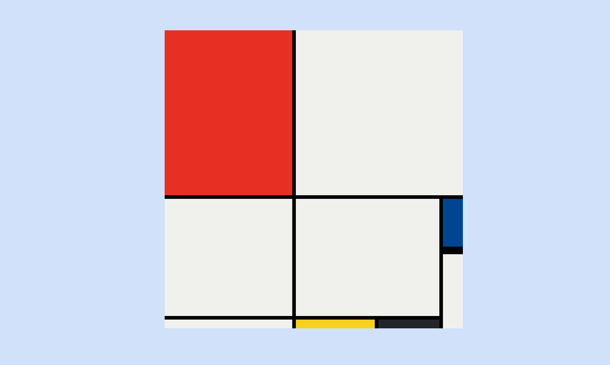

# Mondrian Painting Project

This project is a **Mondrian Painting** layout designed using **CSS Grid**. The layout is inspired by Piet Mondrian's famous painting style, featuring a grid of bold primary colors and simple geometric shapes. The project demonstrates the use of CSS Grid for precise layout control.

## Table of Contents
- [Demo](#demo)
- [Technologies Used](#technologies-used)
- [Features](#features)
- [Getting Started](#getting-started)
- [Usage](#usage)

## Demo

You can view a live demo of the project [here](https://shafayat666.github.io/mondrian-painting/).  


## Technologies Used

- **HTML5**: Markup language used to structure the webpage.
- **CSS3**: Used to create the layout with CSS Grid and style the components.

## Features

- **CSS Grid Layout**: Custom grid structure using row and column spanning to create Mondrian-style artwork.
- **Responsive Design**: The layout adapts based on screen size using CSS Grid features.
- **Color Palette**: Use of bold, primary colors similar to Mondrian's art.

## Getting Started

To get a local copy of this project up and running, follow these steps.
### Prerequisites
To run this project, all you need is a web browser.

### Installation

1. Clone the repository:
   ```bash
   git clone https://github.com/shafayat666/mondrian-painting.git
   ```
2. Navigate to the project directory:
   ```bash
   cd mondrian-painting
   ```
3. Open the ```index.html``` file in your web browser to view the layout.


